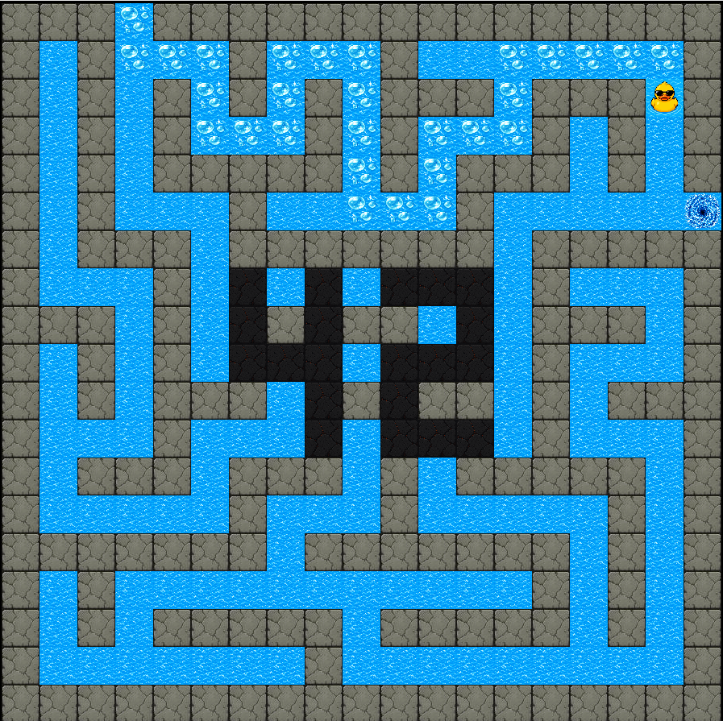
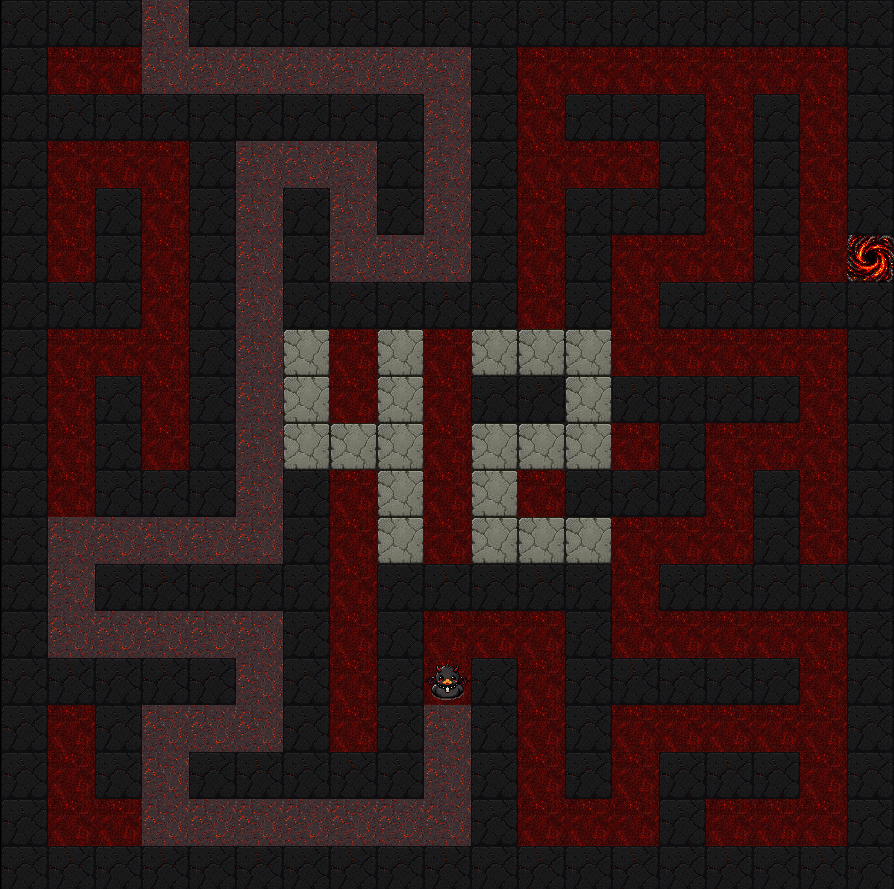

# A-Maze-ing 🧩

*This project has been created as part of the 42 curriculum by `sarfreit` and `bramalho`.*

---

</div>

<div align="center">

### 🧭 Menu Interface


</div>

---

# A-MAZE-ING 🦆

> A retro-inspired maze generator game and pathfinding visualizer made with Python and MiniLibX.

Generate procedural mazes, visualize BFS solving algorithms, switch themes, and explore the maze world with a tiny duck explorer.

---

# 📚 Table of Contents

- [Project Preview](#project-preview)
- [Description](#Description)
- [Project Structure](#project-structure)
  - [assets](#assets)
  - [mazegen](#mazegen)
  - [render](#render)
  - [parsing](#parsing)
  - [utils](#utils)
  - [docs](#docs)
- [Algorithms](#algorithms)
  - [DFS - Maze Generation](#dfs--maze-generation)
  - [BFS - Path Solver](#bfs--path-solver)
- [Installation Instructions](#Installation-Instructions)
- [Reusable Maze Generator Package](#reusable-maze-generator-package)
- [Configuration File](#configuration-file)
- [Game Controls](#game-controls)
- [Maze Rules](#maze-rules)
- [Themes](#themes)
- [Bonus Features](#bonus-features)
- [Technical Notes](#technical-notes)
- [Future Improvements](#future-improvements)
- [Authors](#authors)
- [Resources](#Resources)
- [Additional Documentation](#additional-documentation)

---

# Project Preview

<div align="center">

<table>
<tr>
<td align="center">

### 🌞 Light Mode


</td>

<td align="center">

### 🌚 Dark Mode


</td>
</tr>
</table>

</div>

---

# Description

A-MAZE-ING is a procedural maze generator developed in Python using the MiniLibX graphics library.

The project combines:
- procedural generation
- pathfinding algorithms
- real-time rendering
- retro pixel-art visuals
- theme systems
- gameplay interaction

The maze is generated using DFS (Depth First Search), then solved using BFS (Breadth First Search).

The project also includes:
- animated BFS exploration
- shortest-path visualization
- dynamic asset scaling
- configurable themes
- custom maze exporting system
- 42 logo integration inside the maze itself
- Playable features

---

# Project Structure

```bash
a-maze-ing/
│
├── assets/          # Images, textures, xpm resources
├── mazegen/         # Maze generation and solving algorithms
├── parsing/         # Config parser and validation
├── render/          # MLX rendering system and game window
├── utils/           # Export helpers and path converters
├── docs/            # Documentation and explanations
│
├── a_maze_ing.py    # Main entrypoint
├── Makefile
├── requirements.txt
├── pyproject.toml
└── README.md
```

The project structure separates rendering, parsing, generation, and utility systems to simplify maintenance and future extensions.

---

## assets/

Contains:
- floor textures
- walls
- duck sprites
- vortex exits
- menu backgrounds
- generated resized assets

Assets are automatically resized and converted into `.xpm` files for MLX rendering on render/converter.py.

---

## mazegen/

The `mazegen/` folder contains the core logic responsible for generating and solving the maze.

The project is mainly centered around the `Maze` and `MazeGenerator` classes.
The `Maze` class stores the maze structure itself, including the grid, dimensions, entry, and exit points.
The `MazeGenerator` class acts as the controller of the entire generation pipeline and calls multiple helper functions to keep the project modular and organized.

This folder contains the DFS generation system used to create random procedural mazes, as well as the BFS solver responsible for finding and reconstructing the shortest path.
The BFS system also stores explored cells so the project can animate the pathfinding process visually.

Together, these systems ensure the maze is valid, solvable, and visually consistent for the MLX render.

---

## render/

Handles:
- MLX window
- animations
- menus
- themes
- textures
- gameplay rendering

Includes:
- animated BFS exploration
- animated shortest-path visualization
- dynamic theme switching
- centered rendering system

---

## parsing/

Reads and validates the `.txt` configuration file.

Features:
- duplicate key protection
- required key validation
- automatic type conversion
- semantic validation

---

## utils/

Helper systems used across the project.

Includes:
- maze exporting
- hexadecimal conversion
- path direction conversion

---

## docs/

Contains:
- DFS explanation
- BFS explanation
- MiniLibX documentation
- Rendering system overview
- Maze architecture explanation
- Export system explanation

---

# Algorithms

## DFS — Maze Generation

Depth First Search is used to carve paths through the maze.

The algorithm:
1. Starts from a random cell
2. Visits neighboring cells recursively
3. Removes walls between connected cells
4. Continues until all cells are visited

Result:
- fully connected maze
- no isolated zones
- procedural random generation

# Why DFS

DFS was chosen for maze generation because it naturally creates long corridors and fully connected mazes while remaining relatively simple and efficient to implement.
The recursive backtracking approach also fits procedural generation very well and guarantees that every cell becomes reachable.

---

## BFS — Path Solver

Breadth First Search is used to:
- explore the maze
- discover the shortest path
- animate exploration visually

The BFS system stores:
- visited cells
- explored cells
- parent references
- shortest path reconstruction

---

# Installation Instructions

## Requirements

- Python 3.10+
- Pillow
- MiniLibX
- ImageMagick (for the image convertion)
- Linux / WSL recommended

---

## Install the A-maze-ing 42 project

Install venv (virtual environment):
```bash
make venv
```

Install all dependencies (on venv):
```bash
make install
```

Play / run the project:
```bash
make run
```

or

```bash
python3 a_maze_ing.py config.txt
```

Check for norm errors:
```bash
make lint
make lint-strict
```

Clean:
```bash
make clean
make fclean
```

---

## MLX Library

The project uses the Python MiniLibX wrapper.

Make sure:
- MLX is correctly compiled
- `.whl` file is installed if required

---


## Reusable Maze Generator Package

This project includes a reusable Python package called `mazegen`.

The package contains the core maze generation logic separated from the game and rendering systems, allowing it to be reused in future projects or installed independently.

The reusable module includes:
- Maze data structures
- DFS maze generation
- BFS maze solving
- Entry and exit handling
- Maze validation
- Optional imperfect maze generation

The graphical interface, MLX rendering, themes, menus, and gameplay systems are not part of the package, since they belong to the standalone application.

### Install the Package

```bash
pip install mazegen-1.0.0-py3-none-any.whl
```

### Example Usage
```bash
from mazegen import MazeGenerator

generator = MazeGenerator(
    width=20,
    height=20,
    entry=(0, 0),
    exit=(19, 19),
    perfect=True,
    seed=42
)

maze = generator.generate_maze()
path, explored = generator.solve("bfs")

`solve()` returns a tuple — `path` is the shortest path, `explored` is the list of cells visited during search.

# python and exit() to test on the terminal
```

---

# Configuration File

Example:

```bash
WIDTH=20
HEIGHT=20
ENTRY=0,5
EXIT=19,12
OUTPUT_FILE=output_maze.txt
PERFECT=True
SEED=42
```
Obs. Commented lines start with a #

Parameters: width and height define the maze size, entry and exit must be border coordinates,
perfect=True enforces a single solution, seed fixes the random generation for reproducibility.

Rules:
- ENTRY and EXIT must be placed on maze borders
- WIDTH and HEIGHT must be positive integers
- PERFECT defines whether the maze has a single solution
- SEED allows deterministic maze generation

---

# Game Controls

| Key | Action |
|---|---|
| 1 | Regenerate Maze |
| 2 | Show BFS Path |
| 3 | Show BFS Exploration Animation |
| 4 | Play Manually |
| 5 | Change Theme |
| 6 / ESC | Quit Game |

---

# Maze Rules

The maze follows 42 project constraints.

Rules:
- entry and exit must be on borders
- no invalid coordinates
- no 3x3 fully open areas
- generated maze must always be solvable
- If a seed is given, the maze generated must be always the same
- If "PERFECT=True" on the config file, then there must be only one possible solution to the maze
- Unless the maze is not big enough to showcase it, a 42 logo must be displayed on the center of the maze

---

# Themes

The game supports:
- ☀️ Light Mode
- 🌑 Dark Mode

Theme switching dynamically reloads:
- walls
- floors
- trails
- ducks
- exits

---

# Bonus Features

## 🎮 Menu

An interactive menu to select between light and dark themes, and also a banner inside the game to show the maze / game options.

---

## 🦆 Animated Duck Trail

The duck leaves animated trails while solving the maze.

---

## 🧠 BFS Exploration Animation

Visualizes how BFS explores the maze step by step before discovering the shortest path.

---

## 🖼️ Dynamic Asset Scaling

Assets are automatically resized to match the maze tile size.
The images are also converted in real time to xpm thanks to the use of Pillow and Magick.

---

## 🌗 Theme Switching

Switch between normal and gothic themes during gameplay.

---

## 🎯 Play the Maze

Instead of using the algorithm, you can play the maze yourself by pressing the arrow keys.

---

## 🌀 Animated Exit Vortex

When the player reaches the exit, the portal shows a small animated vortex effect.

---

# Technical Notes

The project uses:
- expanded grids
- wall-cell coordinate mapping
- dynamic MLX rendering
- recursive DFS
- queue-based BFS
- real-time animations

---

# Future Improvements

- Sound effects and ambient music
- More maze themes and visual styles
- Smarter enemy and pathfinding systems
- Save player movements and scores
- UI and menu improvements
- DFS generation animation (showing the maze being built step-by-step)
- Additional solving algorithms
- Continuous player movement with key press support

---

# Authors

🦆 Sara
- MLX rendering system
- BFS animations
- Algorithm creations
- Parsing - config
- theme switching
- maze visual integration
- project architecture

🕹️ Bruno
- menu systems
- Banner options and interactions
- MLX rendering system
- gameplay interactions
- End play animation - "vortex"
- README and documentation
- testing and integration

Made at 42 School.

---

# Resources

Main resources used during development:

- Python documentation
- MiniLibX documentation
- Pillow documentation
- BFS and DFS algorithm references and videos
- 42 intra subject documentation

AI was used mainly for:
- architecture brainstorming
- debugging assistance
- README structure improvements
- asset workflow guidance
- MLX integration troubleshooting

---

# Additional Documentation

For deeper technical explanations about:
- DFS
- BFS
- MiniLibX
- Rendering systems
- Maze architecture
- Export systems

please consult the `docs/` folder included in the project.

---
